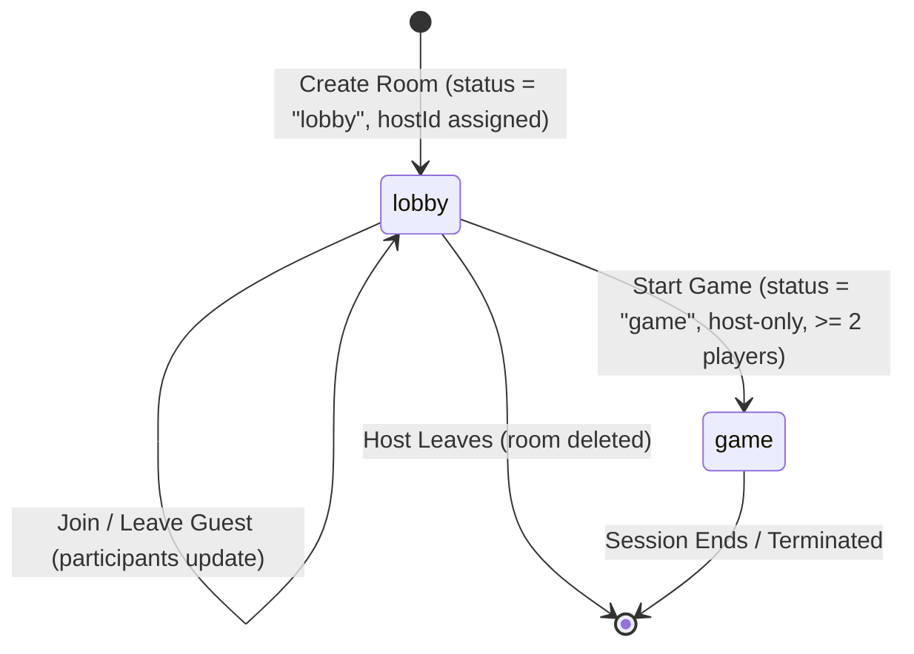

# Data Model & State Transitions: Room Setup & Lobby

This document defines the data structures, Zod validations, and lifecycle states for the Room Setup & Lobby feature.

## Core Entities

### 1. Participant
Represents a player in a game session.

| Field | Type | Description |
| :--- | :--- | :--- |
| `id` | `string` | Unique identifier (UUID v4) |
| `name` | `string` | Trimmed, non-empty name of the player |
| `joinedAt` | `string` | ISO 8601 timestamp of when the player joined |
| `isHost` | `boolean` | Derived property (computed on snapshot serialization based on `Room.hostId`) |

### 2. Room
Represents an isolated game lobby and session.

| Field | Type | Description |
| :--- | :--- | :--- |
| `code` | `string` | Unique 4-character uppercase alphanumeric code (e.g. `H8B3`) |
| `status` | `RoomStatus` | Current lifecycle state: `"lobby"` \| `"game"` |
| `participants` | `Participant[]` | Ordered list of participants in this room |
| `hostId` | `string` | The `id` of the participant who created the room and is designated as the host |
| `createdAt` | `string` | ISO 8601 timestamp of room creation |
| `updatedAt` | `string` | ISO 8601 timestamp of the last status or participant update |

---

## Validation Schemas (Zod)

To ensure request safety, the following validation rules will be enforced via Zod schemas:

### Participant Name
- Must be a string.
- Automatically trimmed.
- Minimum length: 1 character (after trim).
- Maximum length: 32 characters.
```typescript
export const playerNameSchema = z
  .string()
  .trim()
  .min(1, { message: "Name is required" })
  .max(32, { message: "Name must be 32 characters or less" });
```

### Room Code
- Must be a string.
- Automatically trimmed and uppercase-normalized.
- Length: Exactly 4 characters.
- Character Set: Alphanumeric (A-Z, 0-9).
```typescript
export const roomCodeSchema = z
  .string()
  .trim()
  .toUpperCase()
  .length(4, { message: "Room code must be exactly 4 characters" })
  .regex(/^[A-Z0-9]{4}$/, { message: "Room code must contain only letters and numbers" });
```

---

## State Transitions



### 1. Room Creation
- **Trigger**: `POST /api/rooms` with `playerName`.
- **Action**: A new `Participant` is created. A new `Room` is initialized with status `"lobby"` and `hostId` mapped to the new participant's ID. The room is registered in the backend memory map.

### 2. Participant Join
- **Trigger**: `POST /api/rooms/:code/join` with `playerName`.
- **Condition**: Room must exist and be in `"lobby"` status.
- **Action**: A new `Participant` is created and appended to `Room.participants`.

### 3. Participant Leave
- **Trigger**: `POST /api/rooms/:code/leave` with `participantId`.
- **Action**:
  - **Case A: Participant is a Guest**: The participant is removed from `Room.participants`. If this brings the participant count below 2, the "Start Game" button becomes disabled for the host.
  - **Case B: Participant is the Host**: The room is immediately deleted from the backend store. Any subsequent polling request from guests will return a `404 Not Found` error, which redirects guests to the landing page.

### 4. Game Start
- **Trigger**: `POST /api/rooms/:code/start` with `participantId` (representing the caller).
- **Condition**: 
  - Caller's `id` must equal `Room.hostId`.
  - `Room.participants.length` must be `>= 2`.
- **Action**: `Room.status` changes from `"lobby"` to `"game"`. Guests discover this update on their next polling interval and navigate automatically to `/game`.
