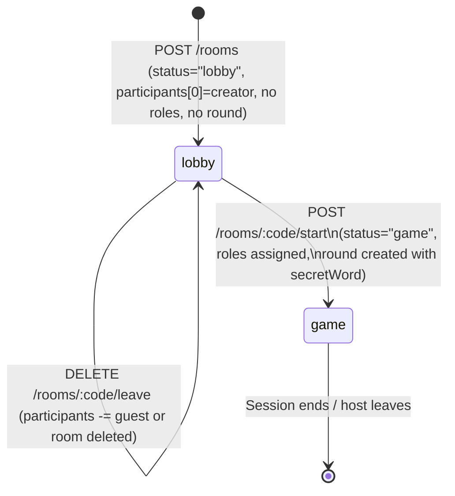

# Data Model & State Transitions: Game Start & Drawer Flow

This document extends the Room Setup & Lobby data model with game-start features: role assignment, secret word selection, and drawer-only visibility.

## Core Entities (Extended)

### 1. Participant (Extended)
Represents a player in a game session, extended with role information when game is active.

| Field | Type | Description | When Defined |
| :--- | :--- | :--- | :--- |
| `id` | `string` | Unique identifier (UUID v4) | Always |
| `name` | `string` | Trimmed, non-empty name (1-32 chars) | Always |
| `joinedAt` | `string` | ISO 8601 timestamp of join | Always |
| `role` | `"drawer" \| "guesser"` | Player's role in the game | Only when `room.status === "game"` |
| `isHost` | `boolean` | Derived property (computed on serialization) | Computed during snapshot serialization |

**Role Assignment Rules**:
- **drawer**: The host participant when game status transitions to `"game"`
- **guesser**: All non-host participants when game status transitions to `"game"`
- Role is NOT defined during `"lobby"` status; it appears only after game starts
- Role persists for the entire game round; does not change mid-round

---

### 2. GameRound (New Entity)
Represents the active game round with metadata and state.

| Field | Type | Description |
| :--- | :--- | :--- |
| `secretWord` | `string` | The word to be drawn and guessed (selected deterministically) |
| `startedAt` | `string` | ISO 8601 timestamp when the round began |

**Constraints**:
- Secret word is always the first word from `STARTER_WORDS` list
- `STARTER_WORDS = ["rocket", "pizza", "castle", "guitar", "sunflower"]`
- Selection is deterministic: no randomization, no seed calculation
- Round is created exactly when game status transitions from `"lobby"` to `"game"`

---

### 3. Room (Extended)
Represents an isolated game lobby and session, extended with round data.

| Field | Type | Description |
| :--- | :--- | :--- |
| `code` | `string` | Unique 4-character uppercase alphanumeric code |
| `status` | `RoomStatus` | Current lifecycle state: `"lobby"` \| `"game"` |
| `participants` | `Participant[]` | Ordered list of participants (extended with `role` when active) |
| `hostId` | `string` | The `id` of the host participant |
| `round` | `GameRound` | Active game round metadata | Only when `status === "game"` |
| `createdAt` | `string` | ISO 8601 timestamp of room creation |
| `updatedAt` | `string` | ISO 8601 timestamp of last update |

**Invariants**:
- When `status === "lobby"`, `round` is undefined; all participants have undefined `role`
- When `status === "game"`, `round` is defined; all participants have assigned `role`
- Status transitions are one-way: `"lobby"` → `"game"` (no reverse in v1)

---

## API Response Contracts (Extended)

### Participant (in RoomSnapshot)
```typescript
interface Participant {
  id: string;                    // UUID
  name: string;                  // 1-32 characters, trimmed
  joinedAt: string;              // ISO 8601
  role?: "drawer" | "guesser";   // Defined only when room.status === "game"
  isHost?: boolean;              // Derived: participant.id === room.hostId
}
```

### RoomSnapshot (with Secret Word Filtering)
```typescript
interface RoomSnapshot {
  code: string;                  // 4-char alphanumeric
  status: "lobby" | "game";
  participants: Participant[];   // role field present/absent per above
  availableWords: string[];      // Always ["rocket", "pizza", "castle", "guitar", "sunflower"]
  roles: ParticipantRole[];      // Always ["drawer", "guesser"]
  secretWord?: string;           // Present ONLY if viewer is the drawer
}
```

**Role-Based Filtering Logic** (in `toRoomSnapshot(room, viewerParticipantId)`):
1. Build participants array with all fields including `role`
2. Check if `viewerParticipantId` is the host (drawer)
3. If viewer IS drawer: include `secretWord` from `round.secretWord`
4. If viewer is NOT drawer (guesser or not in game): exclude `secretWord` field entirely
5. Never include `secretWord` in page source or response body for non-drawers

---

## Validation Schemas (Zod)

### Player Name (Extended)
Extends existing schema with stricter whitespace handling:

```typescript
export const playerNameSchema = z
  .string()
  .trim()                         // Remove leading/trailing whitespace first
  .min(1, { message: "Name is required" })  // Reject if empty after trim
  .max(32, { message: "Name must be 32 characters or less" });
```

**Validation Examples**:
- `"Alice"` → ✅ Valid
- `"  Alice  "` → ✅ Valid (trimmed to `"Alice"`)
- `""` → ❌ Invalid
- `"   "` (spaces only) → ❌ Invalid (trimmed to `""`, then rejected)
- `"A"` → ✅ Valid
- `"VeryLongNameWith33Characters..."` → ❌ Invalid

**Behavior on Validation Failure**:
- Frontend: Display error message immediately, prevent form submission
- Backend: Return `400 Bad Request` with error message, no fallback default name

---

## State Transitions



### State Transition Details

#### 1. Create Room
- **Trigger**: `POST /api/rooms` with valid `playerName`
- **Precondition**: None
- **Action**: 
  - Create new `Participant` with trimmed name
  - Create new `Room` with `status="lobby"`, `hostId` = participant.id
  - `round` field is undefined
  - All participants have undefined `role`
- **Response**: `201 Created` with room snapshot (no secret word)

#### 2. Join Room
- **Trigger**: `POST /api/rooms/:code/join` with valid `playerName` and room code
- **Precondition**: Room exists and `status === "lobby"`
- **Action**:
  - Create new `Participant` with trimmed name
  - Append to `room.participants`
  - Update `room.updatedAt`
  - `round` remains undefined; no role assignments yet
- **Response**: `200 OK` with room snapshot (no secret word for any participant)

#### 3. Start Game
- **Trigger**: `POST /api/rooms/:code/start` with host `participantId`
- **Precondition**: 
  - Room exists and `status === "lobby"`
  - Caller is the host
  - At least 2 participants in room
- **Action**:
  - Change `room.status` from `"lobby"` to `"game"`
  - Create `GameRound` with `secretWord = "rocket"` (first word) and `startedAt = now()`
  - Assign roles:
    - Host participant: `role = "drawer"`
    - All other participants: `role = "guesser"`
  - Update `room.updatedAt`
- **Response**: `200 OK` with updated room snapshot
  - If viewer is host (drawer): includes `secretWord: "rocket"`
  - If viewer is guest (guesser): excludes `secretWord`

#### 4. Leave Room
- **Trigger**: `DELETE /api/rooms/:code/leave` with `participantId`
- **Precondition**: Room exists
- **Action**:
  - If participant is host: delete entire room from backend store
  - If participant is guest: remove from participants array
  - Update `room.updatedAt`
- **Response**: `200 OK`
- **Side Effect**: Guests of deleted room get `404 Not Found` on next poll

---

## Key Constraints & Edge Cases

### Empty Name Handling
- **Rule**: Reject immediately with `400 Bad Request`
- **No fallback**: Do NOT auto-assign default name like `"Player"`
- **Trimming**: Occurs BEFORE validation, so `"   "` is rejected as empty

### Drawer Role Specifics
- **Single per game**: Exactly one drawer (the host)
- **Secret word visibility**: ONLY the drawer's API responses include `secretWord`
- **Page rendering**: Drawer's browser receives `secretWord` and displays it on GamePage
- **Guesser constraint**: Guesser's API responses never include `secretWord`; their browser cannot display it

### Word List Constraints
- **Non-empty assumption**: `STARTER_WORDS` is always `["rocket", "pizza", "castle", "guitar", "sunflower"]`
- **Exhaustion (v2)**: Multiple rounds would require tracking used words (out of scope)
- **Deterministic**: Same list always yields same word (`"rocket"`)

### Participant Count Constraints
- **Minimum to start**: 2 participants (1 host + 1 guest minimum)
- **No maximum**: Current implementation allows unlimited participants

---

## TypeScript Type Definitions

```typescript
export type ParticipantRole = "drawer" | "guesser";
export type RoomStatus = "lobby" | "game";

export interface Participant {
  id: string;
  name: string;
  joinedAt: string;
  role?: ParticipantRole;
  isHost?: boolean;  // Computed during serialization
}

export interface GameRound {
  secretWord: string;
  startedAt: string;
}

export interface Room {
  code: string;
  status: RoomStatus;
  participants: Participant[];
  hostId: string;
  round?: GameRound;
  createdAt: string;
  updatedAt: string;
}

export interface RoomSnapshot {
  code: string;
  status: RoomStatus;
  participants: Participant[];
  availableWords: string[];
  roles: ParticipantRole[];
  secretWord?: string;
}

export interface RoomSessionResponse {
  participantId: string;
  room: RoomSnapshot;
}
```

---

## Summary of Data Model Changes

| Entity | Change | Impact |
|--------|--------|--------|
| `Participant` | Add optional `role` field | Defines player's game responsibility |
| `Room` | Add optional `round` field | Stores secret word and round metadata |
| `RoomSnapshot` | Add optional `secretWord` field | Role-based API response filtering |
| `GameRound` (new) | N/A (new entity) | Encapsulates round state |
| Name validation | No schema change | Existing Zod `.trim().min(1)` is sufficient |

All changes are **additive** (new optional fields). Backward compatibility with "lobby" status maintained: `role` and `round` are simply undefined.
